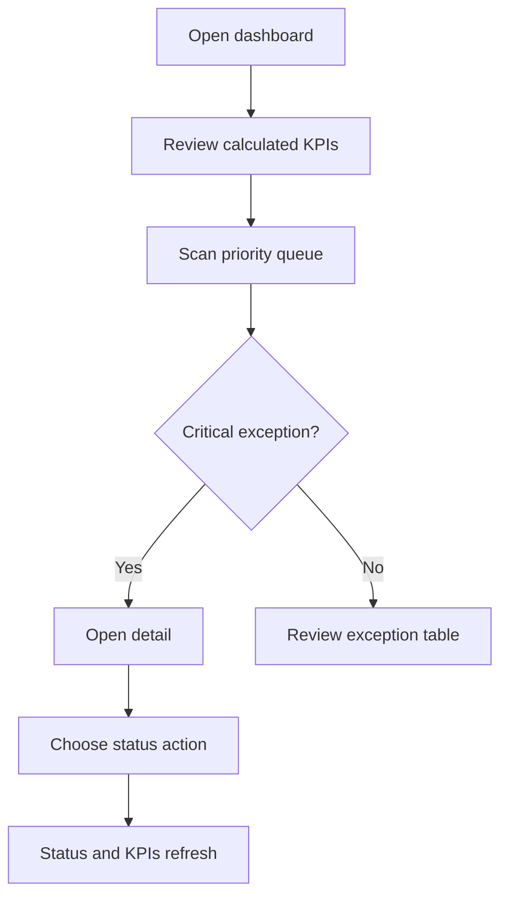
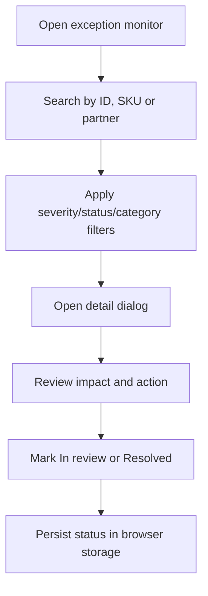
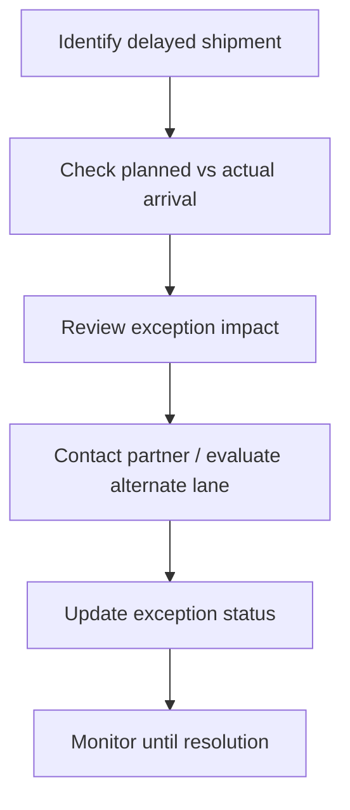

# User flows

## 1. Control tower overview

```mermaid
flowchart TD
 A[Open dashboard] --> B[Review calculated KPIs]
 B --> C[Scan priority queue]
 C --> D{Critical exception?}
 D -- Yes --> E[Open detail]
 D -- No --> F[Review exception table]
 E --> G[Choose status action]
 G --> H[Status and KPIs refresh]
```

## 2. Exception triage

```mermaid
flowchart TD
 A[Open exception monitor] --> B[Search by ID, SKU or partner]
 B --> C[Apply severity/status/category filters]
 C --> D[Open detail dialog]
 D --> E[Review impact and action]
 E --> F[Mark In review or Resolved]
 F --> G[Persist status in browser storage]
```

## 3. Shipment investigation

```mermaid
flowchart TD
 A[Identify delayed shipment] --> B[Check planned vs actual arrival]
 B --> C[Review exception impact]
 C --> D[Contact partner / evaluate alternate lane]
 D --> E[Update exception status]
 E --> F[Monitor until resolution]
```
